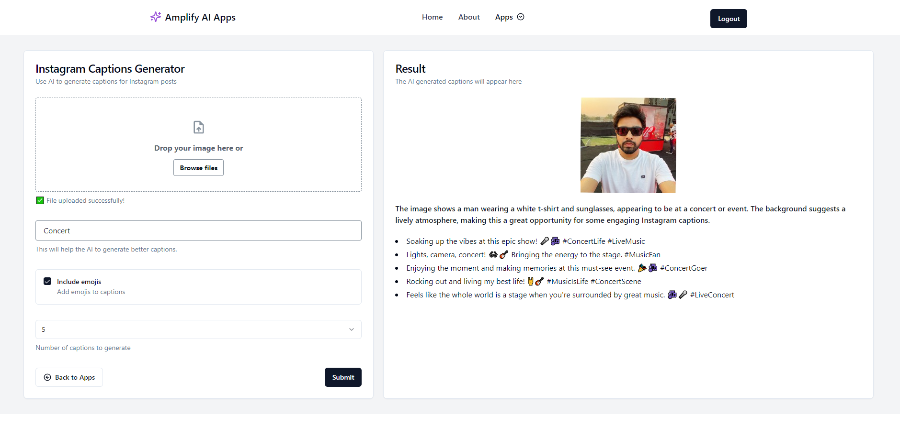
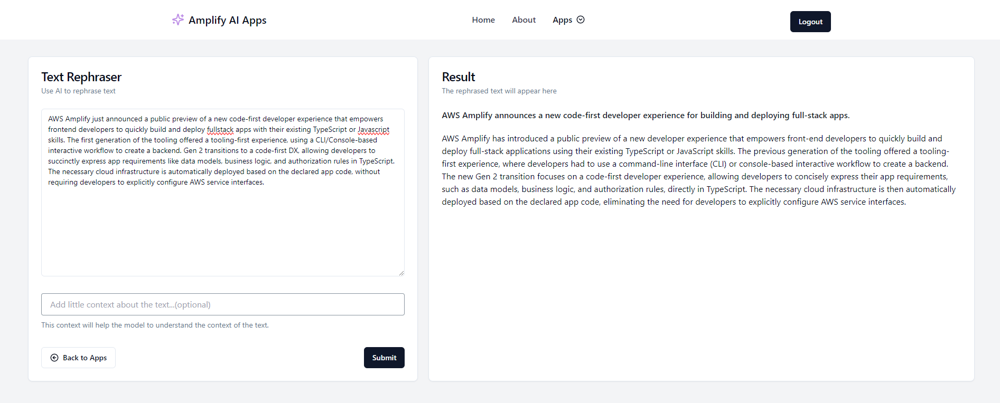
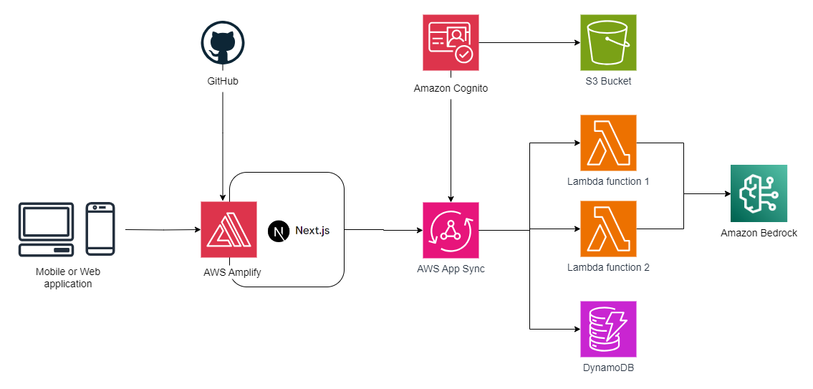

# Full-Stack AI Apps with AWS Amplify Gen2 and Amazon Bedrock

This is a simple app that demonstrates how to build Generative AI apps with AWS Amplify Gen2 and Amazon Bedrock.

Currently, the app features two AI-powered tools:
1. **Instagram Captions Generator** - Use AI to generate captions for Instagram posts
2. **Text Rephraser** - Use AI to rephrase text

## Demo
- Live Deployment: [Amplify AI Apps](https://main.dv2wiefoyjqb9.amplifyapp.com)
- Source Code: [GitHub Repository](https://github.com/ankushjain358/aws-amplify-gen2-bedrock-ai-apps)

### Instagram Captions Generator

### Text Rephraser

## Tech Stack
- **Backend**: AWS Amplify Gen2, TypeScript
- **Frontend**: Next.js, React, Tailwind CSS, Shadcn UI
- **AWS Amplify Technologies**: Data (Amazon DynamoDB), Authentication (Amazon Cognito), Serverless Functions (AWS Lambda), File Storage (S3)
- **AWS Others**:  AWS CDK, Amazon Bedrock
- **Hosting**: AWS Amplify

## Architecture

## Pre-requisite for running App
1. AWS Account
2. On the Model access page in **Amazon Bedrock**, Enable access for  `anthropic.claude-3-haiku-20240307-v1:0` model.

## Running App Locally
1. Clone the repository on your local machine.
2. Run `npm install` to install dependencies.
3. Configure AWS Profile
3. Run `npx ampx sandbox` to provision backend infra in AWS.
4. Run `npm run dev` to run the app.
5. Open `http://localhost:3000` with your browser to see the result.

## Deploying to AWS
1. Fork the repository in your GitHub account.
2. Follow the detailed instructions on deploying your application, refer to the [deployment section](https://docs.amplify.aws/nextjs/start/quickstart/nextjs-app-router-client-components/#deploy-a-fullstack-app-to-aws) of our documentation.
